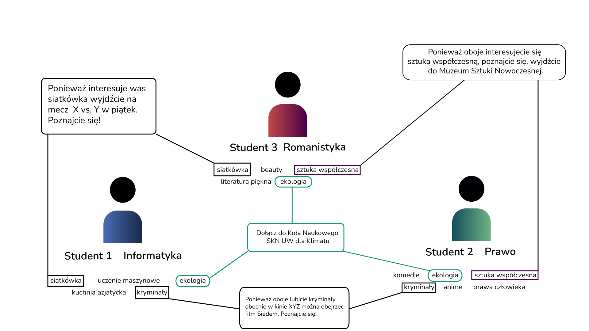

Aplikacja łączy studentów na podstawie ich zainteresowań i sugeruje wspólne wydarzenia oraz aktywności. Zamiast klasycznego "swipowania", system automatycznie grupuje użytkowników w małe zespoły, proponując im konkretne spotkania. Agreguje lokalne wydarzenia i umożliwia firmom oraz uczelniom organizowanie inicjatyw integracyjnych. Dodatkowo, mechanizmy zachęt (np. zniżki, nagrody) promują rzeczywiste spotkania, a współpraca z uczelniami i poradniami psychologicznymi zapewnia dodatkowe wsparcie dla studentów odczuwających samotność.

Nie byłaby to typowa platforma społecznościowa w rozumieniu Facebooka, Instagrama czy X, budująca zaangażowanie w świecie cyfrowym. Jej celem byłoby połączenie ludzi na podstawie ich zainteresowań i dzięki systemowi rekomendacyjnemu polecenie pobliskich wydarzeń powiązanych z zainteresowaniami. Tworzenie zaangażowania w namacalnym świecie, wspieranie lokalnych firm, tworzenie społeczności. Algorytm promowałby spotkania offline i polecał lokalne wydarzenia kulturowe – kino, teatr, koncerty, eventy, warsztaty.

